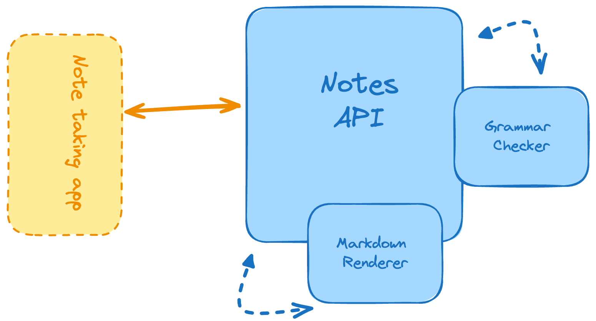

# Техническое задание

## Цель и задачи

Цель: разработать API сервиса хранения заметок в формате Markdown

Задачи:
- Создать endpoint для проверки грамматики заметки
- - Определить правила грамматики
- - Задать способ проверки
- Создать endpoint для загрузки и сохранения заметки
- Создать endpoint для получения заметки в html формате
- Создать endpoint для обновления и удаления заметки по id
- Написать docker-compose.yml файл для быстрого запуска проекта
- Написать тесты
- - Написать тесты на все endpoint-ы для всех возможных сценариев использования
- - Написать тесты для позитивного и негативного тестирования
- Написать документацию
- - Описание проекта
- - Порядок установки, настройки и запуска
- - Инструкция
- - Технологический стек
- - Структура проекта
- - Структура БД

## Концептуальная модель

